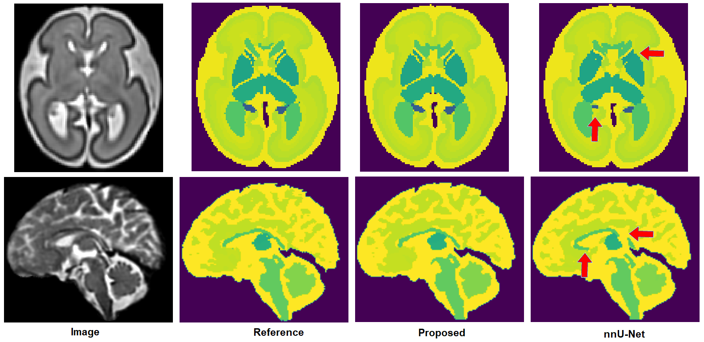
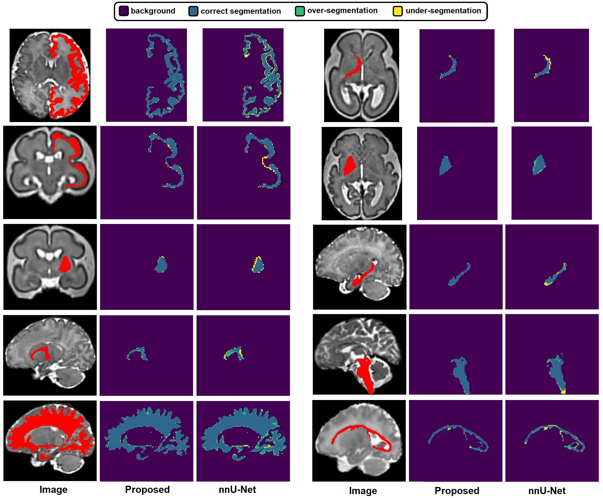

# Learning to segment fetal brain tissue from noisy annotations

This repository contains the code for the following paper:

Learning to segment fetal brain tissue from noisy annotations, by Davood Karimi, Caitlin K. Rollins, and Clemente Velasco-Annis, Abdelhakim Ouaalam, and Ali Gholipour.

The purpose of the project is automatic segmentation of fetal brain, in the gestational age (GA) range of 19-39 weeks, into over 30 tissue compartments. Separate models have been trained for younger fetuses (GA<32) and older fetuses (GA>32).

It was developed at IMAGINE laboratory of Harvard Medical School (https://imagine.med.harvard.edu/).

Trained models can be downloaded from the link below.

https://tinyurl.com/yw2nbaa7

For any questions, please contact davood.karimi@childrens.harvard.edu.

## Example results:

The following show example results on independent test images.

